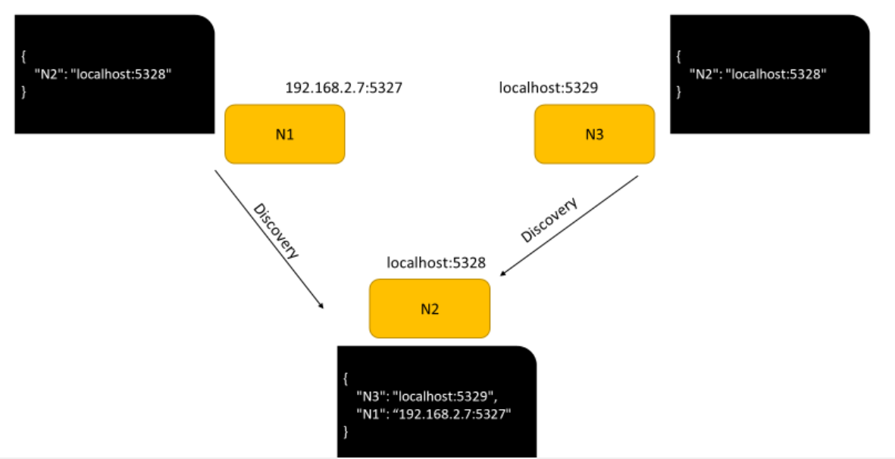

# Netwolf
A program that enables the users to transfer files via a P2P connection.

## Section 1 - Starting the program
to start the program, you have to simply enter the following command in the terminal:

`python Netwolf.py -f <file_name> -d <folder_name>`

Therefore, after -f, you have to enter the directory of a file that stores the nodes in the discovery section (we'll see it later on) in JSON format. After -d, you need to enter the folder directory that keeps files that we transfer via TCP.

\* **Note that these arguments are optional, and if we omit them, the program creates Default_Node.json as a file and Default_Folder as a directory**

After starting the program we're going to face with these questions:

At first, It asks the name of the node. This word is equal to the name that other nodes in our cluster can identify and stores on their discovery file (which is actually the JSON file that we specify)

After that, the program uses ipconfig on windows (or ifconfig on Linux) to detect the IPv4 address of your WiFi (this won't work if you don't have any WiFi) and asks the user whether the node should be localhost (for inside physical machine communication) or WiFi IPv4 (for communication between two physical machines inside a local network). Other than that, the user has the ability to enter the IPv4 manually for the UDP server address.

At next step, the program wants the user to enter a port which should be a number above 1023.

In the next 3 steps, the user has to enter 3 parameters  which are these three respectively:
1. The time delay between sending a discovery message
2. the amount of waiting time after sending get-message
3. maximum numbers of concurrent connections

After giving inputs, the program informs what the UDP and TCP addresses and ports are. For TCP, it randomly detects an address.

## Section 2 - Discovery Message
#### Message Formats
Message formats for communication between nodes are based on a JSON format such as:  
{  
“Node_name1”: “address:UDP_PORT”,  
“Node_name2”: “address:UDP_PORT”,  
...  
}  

But in cases when the communication between the nodes are not inside a physical machine, then the format would be like:  
{  
 “Main_node_name”: {“address”: “address:UDP_PORT”, “cluster”: <Local_Nodes>  
}  
That instead of <Local_Nodes> we have a string like the first format

#### Discovery Scenario
In this part, at first, we create 3 nodes as in the below image, the black containers contain JSON data, whereas yellow containers contain the name of each node with their address beside them.

We set the period of discovery message for N2 to 20 seconds and N1 and N3 to 30 seconds. Hence after 20 seconds, we have:

And 10 seconds later at time 30 we have:

And at the end, at time 40 we have:

The result of the conferred diagrams are apparent here:

Now let's consider we have N4 and N5 at a separate physical machine and want to make a discovery to find them. Such as the N1 address is stored in N5, and the N5 address is stored in N5.  According to the diagram below, after making connections, we have:

Even though in local nodes we store addresses of each node inside a physical machine, it's necessary to mention that this feature is only designed to show network status for users, and in further sections, we'll see if N2 wants to send a message to N5, it should do it with the help of nodes N1 and N4  
After the connection between nodes, information inside the discovery files of N4 and N5 are equal to:

## Section 3 - Get Message
In this section, the user requests to receive a file, and this request broadcasts through the nodes of the network, and when it receives a response, it accepts the fastest one.

Sending get-message can be done in two ways:
1. between nodes of a physical machine
2. between separate physical machines

At First, we examine the first way:  
let's suppose that we have three nodes, N1, N2, and N3, inside a physical machine. N3 has test3.txt with 5 bytes volume. N1 requests to receive that file; hence user inside N1 types this request on our program:  
`get test3.txt`  
Then N1 sends a message with this format to N2 and N3:  
`b'get test3.txt 192.168.2.7:5327'`

The `b' '` demonstrates that this message is encoded in byte format. As we see in the following part of this request, N1 puts address and UDP port of itself just because in case that the file exists, they send the response to this address and port. Then it waits as long as the moment that the user has specified at the first part of the program.

Let's assume that N2 receives the message. It will check that whether it has the file or not. In our case, it doesn't have; therefore, it does nothing. But when N3 receives the message, it actually has the file, so it responds to that message with this response:  
`b'contain 5_localhost:9205:5329'`

As we see in the above response, with the word 'contain' it shows that it has the file, but let's consider the format deeply:  
After 'contain', we always send a number following by an underline that separates the number from the rest of the information. This number shows the file size. Therefore while receiving a file with the help of TCP, we exactly know what the data size is and how many bytes should we receive.

Following the underline, we see three expressions separated by a colon. The first expression is the TCP address that N3 listens to it. (it's equal to the UDP server address). The second one is the TCP port that server listens to. And the last one is the server's UDP port. The UDP port is for the FREERIDE that we see in a subsequent section.

If we remove the comments inside the `start_UDP_server` function, to confirm the above explanations, we have:

Now let's consider the second way!  
Image that we have a network like this:

In the above network, let's assume N5 has N5.txt with size 7B. N2 requests to receive this file. So the user at N2 types the following command on our program:  
`get N5.txt`  
So this message is being sent to N1 and N3:  
`b'get N5.txt localhost:5328'`

Regarding the fact that these two don't contain this file, they don't respond. But N1 perceives that it is a main node of the physical machine. Consequently, it tries to redirect the message to each main node of other physical machines. The redirect message format would be something like this:  
`b’GET-REDIRECT N5.txt 192.168.2.7:5327 localhost:5328’`

N4 receives the above message; due to observing GET-REDIRECT at the end of the message, it acknowledges that it's a redirect message. Following GET-REDIRECT, it's written following information afterward:
1. Name of the file
2. UDP server information of the node sending this message.
3. UDP server information of the node requesting the file.

N4 understands that it doesn't have that file; therefore, it won't respond any. But since its address (192.168.2.11) and sending address (192.168.2.7) is not equal to localhost, it realizes that the connection is between two physical machines; hence it redirects the message to all of its local nodes.    

So N5 would receive this message:  
`b’GET-REDIRECT N5.txt 192.168.2.11:5330 192.168.2.7:327 localhost:5328’`

N5 realizes that it should check whether it has N5.txt or not. Since it has, it responds with a CONTAIN-REDIRECT message to N4 like this:  
`b’CONTAIN-REDIRECT 7_localhost:50397:5331 192.168.2.7:5327 localhost:5328’`

N4 receives the above message. Since N5 has that file, only in N5 the TCP Port is written, and the rest is only UDP. It's worthy of mentioning that 5331 for N5 is for the FREERIDE section that we review in the subsequent section.

N4 needs to know to which node it should respond; therefore, it always looks at the first expression containing underline. In our case, it responds to 192.168.2.7, which is N1. N1 receives this message:  
`b'CONTAIN-REDIRECT 7_localhost:50397:5331-192.168.2.11:50396:5330
localhost:5328'`  

In the above message, it's evident that a file with size 7B is available. This file is located in `localhost:50397`. to reach this file, we should pass through node `192.168.2.11:50396` as a router. So it informs N1 that it should give this message to `localhost:5328`, which is N2. But due to the fact that the last expression contains only the information of a node. N1 realizes that N2 is the latest node and sends `contain` message to it:  
`b'contain 7_localhost:50397:5331-192.168.2.11:50396:5330
192.168.2.7:9203:5327'`

The only difference between this message and the first-way message is that instead of a node, we have a sequence of nodes separated by hyphens. While requesting to receive a file via TCP, it sends the request from the end to the beginning of listed nodes.

If we had removed comments on `start_UDP_server`, we would observe the following messages in different nodes:

## Section 4 - Free-ride prevention
In order to prevent free-ride, when a node receives `get` message from the other node or receives `GET-REDIRECT` one, it just looks at its`prior_communications` dictionary. If the node is not inside the dictionary, it will create an entry just like the JSON file format of the discovery section. Such that its value is a timestamp. Otherwise, it looks at the dictionary and checks the current timestamp with the previous one. And creates a delay with a value that is actually a difference between these two timestamps divided by 10,000. In other words, for each second, it creates a 0.01-second delay. To check whether it works correctly or not, we can remove the comments of `free_ride` function.

This value on the dictionary will be updated when the other node responds to the `get` message and receive a file from it. In that case, `update_free_ride` function will be executed.

## Section 5 - Requesting a file
The procedure is simple. First, our program creates a temporary TCP connection (The permanent TCP connection is listening to requests only). Then in `contain` message, if there's one destination,  `send` message will be sent and received. Otherwise a message like `GET-REDIRECT` this time with `redirect-send` will be sent, and the file is received.

## Section 6 - Adding new node to the dictionary
Since JSON file has a specific format, for convenience, an `add` command is implemented on the program to make the progress of adding a node to the dictionary easier for the user.